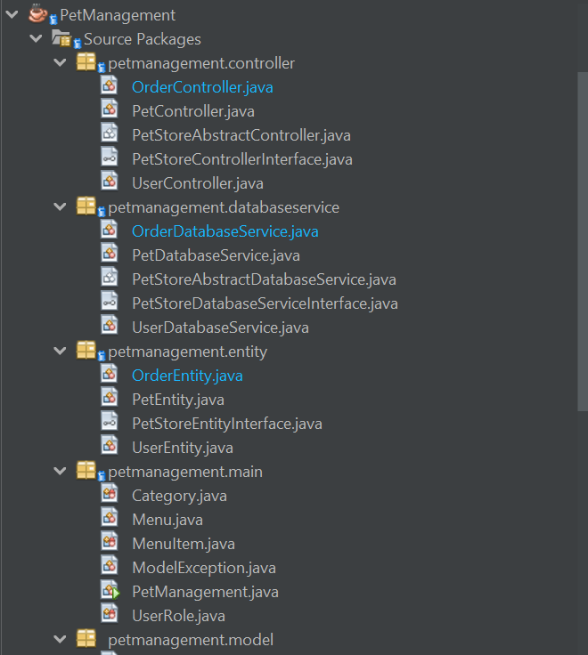
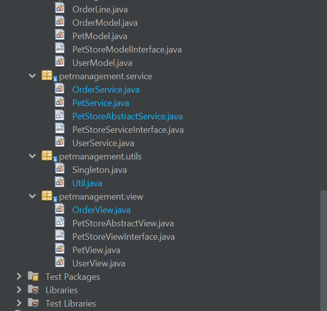

# Welcome to OOP-with-Java-Lab Repo

* study OOP Lab with Java 
* applied Design Pattern
* used Apache NetBeans IDE 15, jdk 19
* mentored by Lecturer HaNS

## Pet Management source code

#### Copyright &#169; Spring 2023 nhilty 
